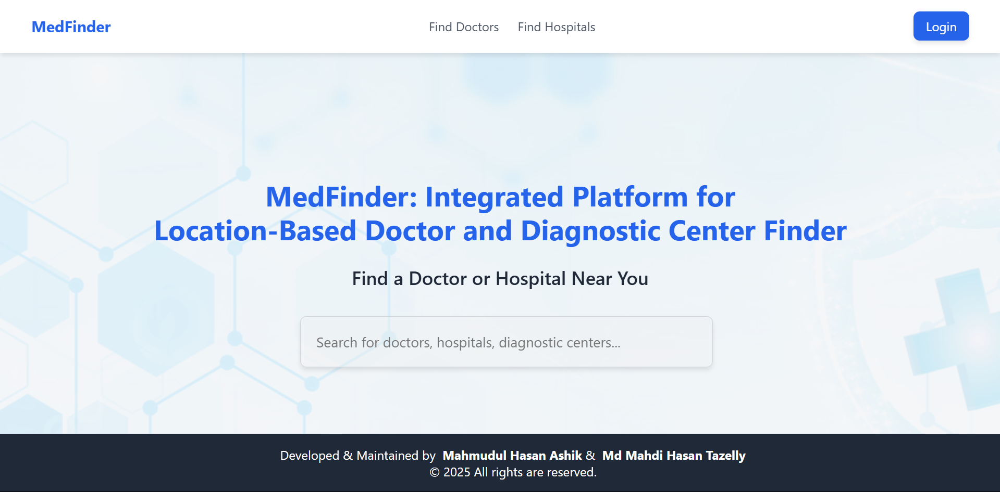
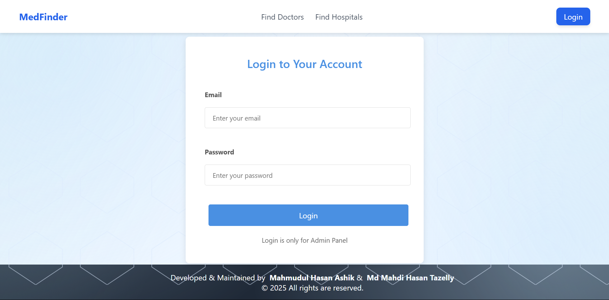
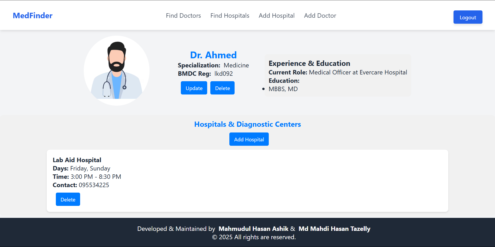
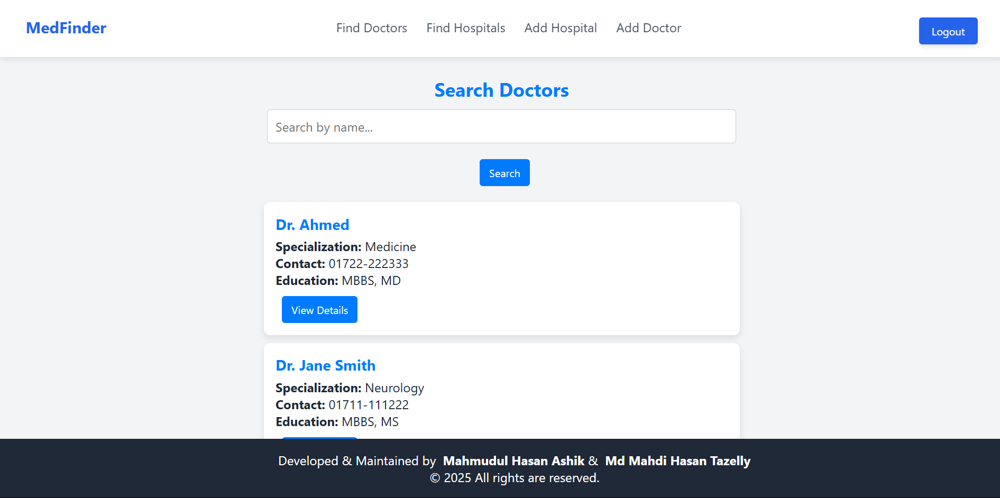
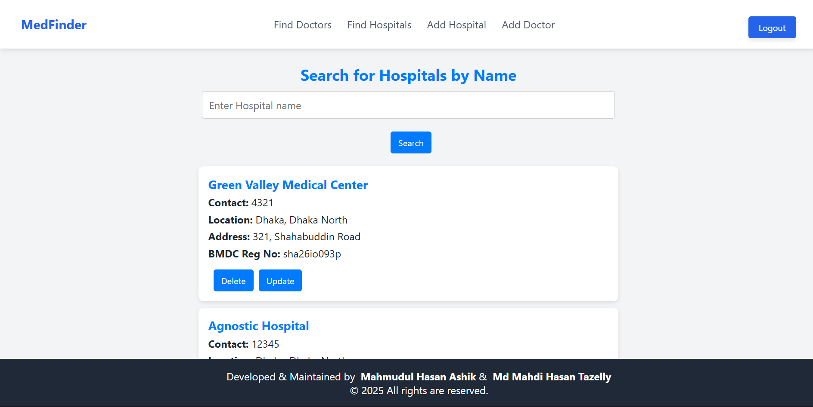
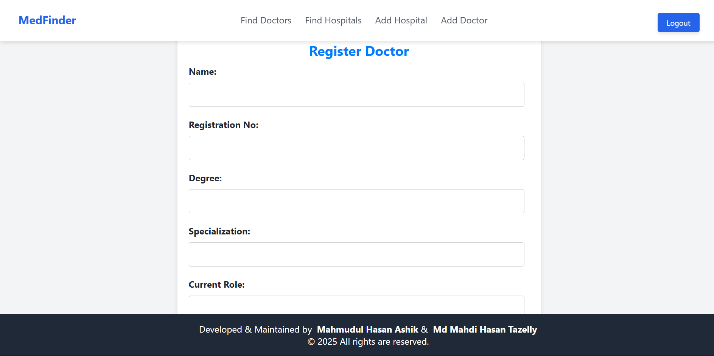
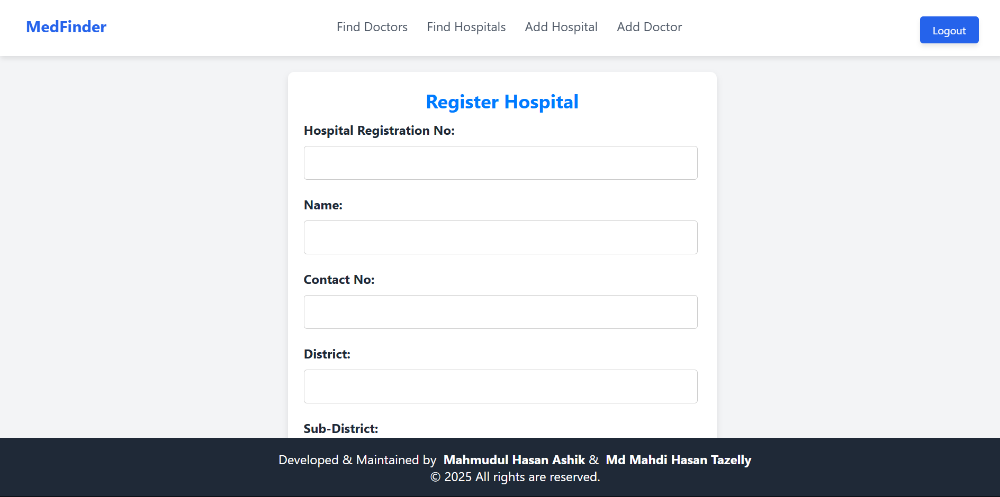
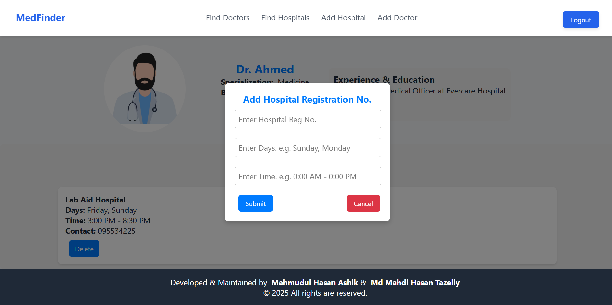

# MedFinder
It's an integrated platform for finding doctors and hospitals infromation. As a course project of Junior Design, I and Mahmudul Hasan Ashik have built this project. 
There are 2 views.
- User
- Admin  

### Features
- User can only see the informations.
- The admin can add, delete, update the hospitals and doctors informations. However, no one can be an admin randomly. Technical team
will assign someone as admin.
- A named based searching is implemented for both doctor and hospital. User can see doctors or hopitals info related to the given search query.
- Doctors chamber information canbe seen as well. If any hopital is not affiliated with this application, the hospitals can't be added as doctors chamber.

[See Demo Video](https://www.youtube.com/watch?v=XLJKFxgCcJc)

### Group Member's Contributin:
- Mahmudul contributed mainly in the frontend part. He built the Landing page, Doctor's details info page and Login page.
- Rest of the frontend, bacend and database creation have handled by me.

> NB: For frontend, React.JS is used here.

## Screenshots
### Mahmudul's contributions
#### Landing Page
 
#### Login Page
 
#### Doctor's Details

### My contribution
#### Doctor's & Hospitals Search Page

#### Doctor's & Hospitals Registration

#### Doctor's Chamber

